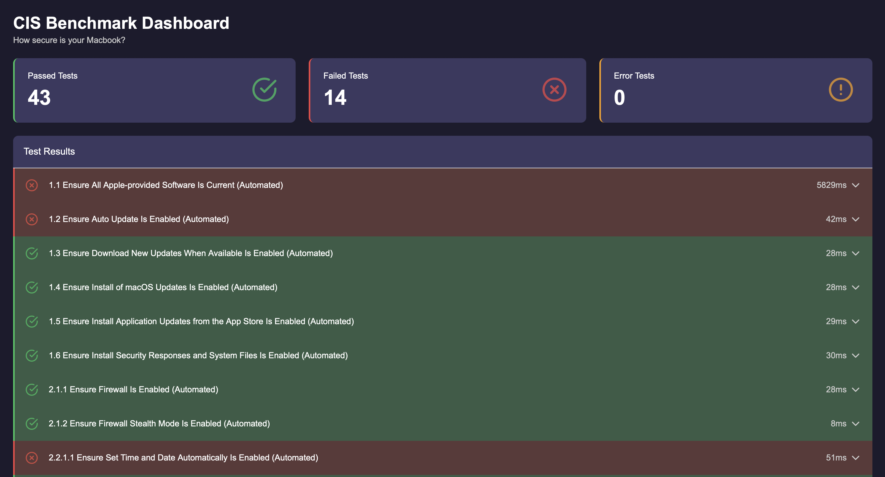
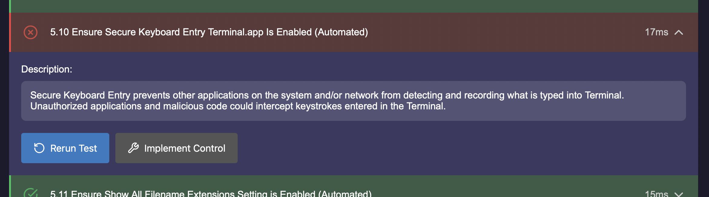
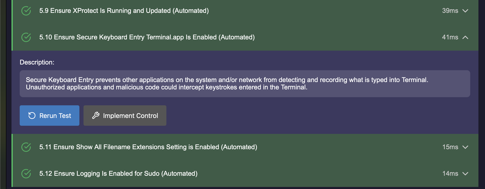

# How Secure is Your Mac?
The [Center for Internet Security](https://www.cisecurity.org) periodically releases security benchmarks for different operating systems. These act as a good baseline for making sure your computers are at least somewhat secure. While the Windows benchmarks are primarily UI based, the macOS benchmarks are exlusively run from the commandline. This makes them easy to automate, but sometimes difficult to implement for users less familiar with the inner workings of their machines. Unfortunately those people are also often the most vulnerable when it comes to exploiting holes in the security of their personal devices. 

This is a tool to help solve that issue. It is a fully UI based auditing service that checks how many benchmarks you are already complying with, and how many still need to be implemented.

Expanding each benchmark gives you a description of what it's targeting, and the options to rerun the test, or run an automated script to fix it.

Upon running the automated script, it will execute the commands given by the CIS Benchmark, and then re-run the audit.

## How to run
1. Clone this repository
2. Navigate to the `./backend` folder
3. Run `sudo node main.js` to execute the auditing script
4. Open `./frontend/index.html` in your browser

## Moving Forward
1. Use local user's username
2. Fix permission denied scripts
3. Package into an app