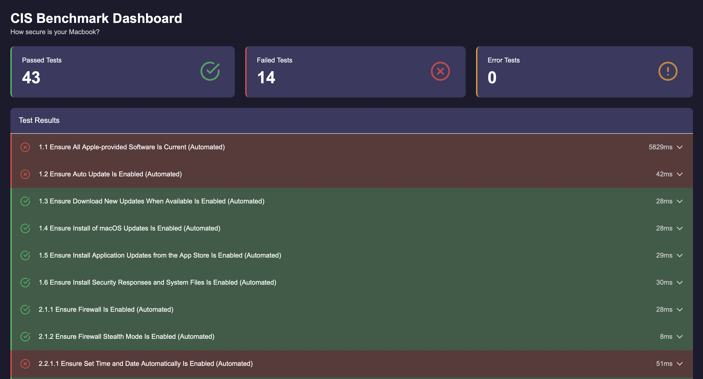
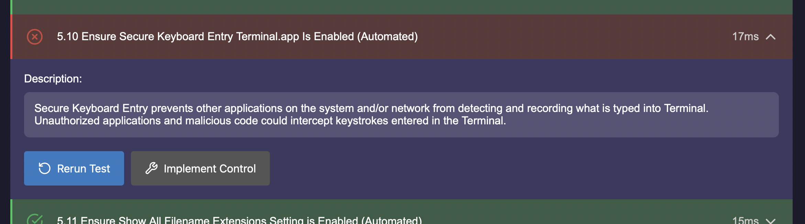
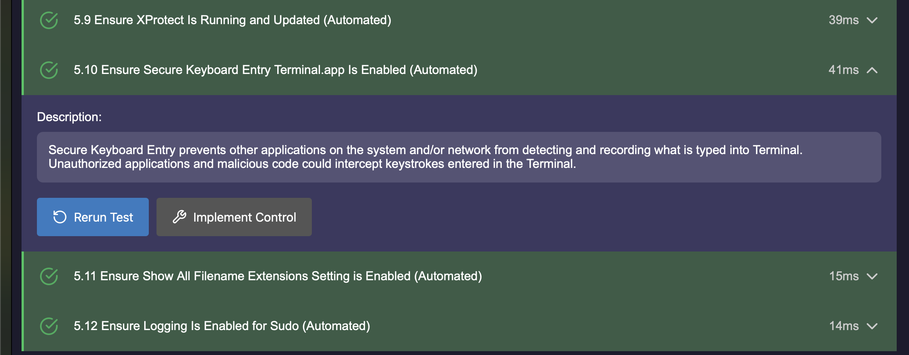

# How Secure is Your Red Hat box?
The [Center for Internet Security](https://www.cisecurity.org) periodically releases security benchmarks for different operating systems. These act as a good baseline for making sure your computers are at least somewhat secure. While the Windows benchmarks are primarily UI based, the RHEL benchmarks are exlusively run from the commandline. This makes them easy to automate, but sometimes difficult to implement for users less familiar with the inner workings of their machines. Unfortunately those people are also often the most vulnerable when it comes to exploiting holes in the security of their personal devices. 

This is a tool to help solve that issue. It is a fully UI based auditing service that checks how many benchmarks you are already complying with, and how many still need to be implemented.


Expanding each benchmark gives you a description of what it's targeting, and the options to rerun the test, or run an automated script to fix it.


Upon running the automated script, it will execute the commands given by the CIS Benchmark, and then re-run the audit.


## Install Required Packages
```sh
sudo dnf install -y git python npm 
```

## How to run
1. Clone this repository
2. Navigate to the `./backend` folder
3. Run `sudo node main.js &` to run the backend in the background
4. You now have the choice of running locally or publically to be accessed from another device
### Local
1. Open `frontend/index.html` in your browser

### Remote
1. Allow access through firewall 
```sh
sudo firewall-cmd --add-port=8000/tcp --permanent
sudo firewall-cmd --add-port=3000/tcp --permanent
sudo firewall-cmd --reload
```
2. edit config to include your ip
```sh
sudo dnf install -y nano
nano ../frontend/js/config.js
```
3. Within the backend folder run `python -m http.server -d ../frontend/ 8000`
